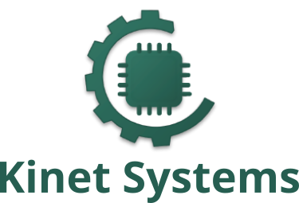

  

    

Kinet Systems is a software development company based in Ethiopia, focused on building innovative solutions that extend and enhance open-source platforms. Our mission is to provide reliable, scalable, and high-quality software for businesses, schools, and enterprises.

---

## About Us

- **Founded:** 2025  
- **Website:** [https://www.kinet.et](https://www.kinet.et)  
- **Email:** [info@kinet.et](mailto:info@kinet.et)  
- **Headquarters:** Addis Ababa, Ethiopia  

We specialize in:

- Enterprise Resource Planning (ERP) customization and development  
- Mobile and desktop application development with Flutter and Dart  
- Cloud-based solutions and SaaS applications  
- Integration with open-source platforms such as ERPNext and Frappe  

---

## Our GitHub Organization

This GitHub organization hosts our projects, libraries, tools, and contributions to open-source software. Here you will find:

- [ERPNext and Frappe extensions](#)  
- [Flutter and Dart apps](#)  
- [Open-source utilities and frameworks](#)  

We follow best practices in software development, including:

- Clear documentation  
- Modular and extensible code  
- Testing and CI/CD pipelines  

---

## How to Contribute

We welcome contributions from the community! To get started:

1. Fork the repository you want to contribute to  
2. Create a feature branch (`git checkout -b feature-name`)  
3. Commit your changes (`git commit -m 'Add feature'`)  
4. Push to the branch (`git push origin feature-name`)  
5. Open a Pull Request  

Please follow our [Code of Conduct](CODE_OF_CONDUCT.md) and [Contributing Guidelines](CONTRIBUTING.md).  

---

## Connect with Us

- [LinkedIn](https://www.linkedin.com/company/kinet-systems)  
- [Website](https://www.kinet.et)  
- [Email](mailto:info@kinet.et)  

Thank you for exploring our projects and supporting open-source innovation in Ethiopia and beyond!  

---

*© 2025 Kinet Systems. All rights reserved.*
